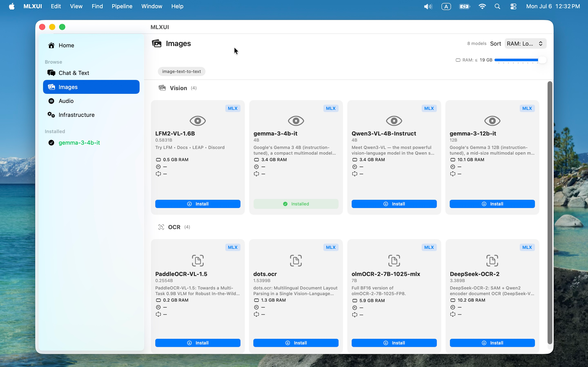
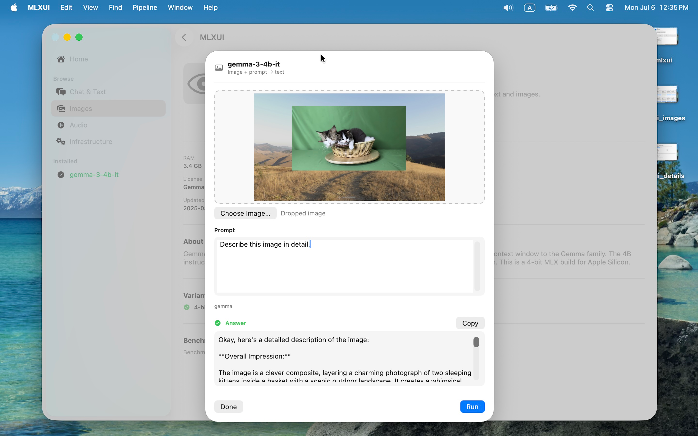

# MLXUI &middot; Local AI Workbench

*Run MLX models visually — no terminal, no Python, no command-line flags.*

[](https://developer.apple.com/macos/)
[](https://swift.org)
[](LICENSE)
[](https://developer.apple.com/macos/)

MLXUI is the **SwiftUI user interface layer for MLX models** — a native macOS app built on
[`mlx-swift`](https://github.com/ml-explore/mlx-swift) that lets you browse, install, and
run local AI models on Apple Silicon. It ships a curated catalog of MLX-optimized models
from Hugging Face's [`mlx-community`](https://huggingface.co/mlx-community), downloads
them with one click, and provides a purpose-built Run UI for each model type.

> **The mission:** become the UI layer for every MLX model on Hugging Face — the place
> where anyone on a Mac can discover, download, and try out local AI without ever opening
> a terminal.

---

## What this is

There are thousands of MLX models on Hugging Face. Using them today means finding the
right repo, reading the README, managing Python dependencies, figuring out CLI flags,
and converting formats when things don't match.

MLXUI replaces all of that with a single app. Browse by category (Chat & Text, Vision,
OCR, Speech-to-Text, Text-to-Speech, Embeddings), filter by what fits your hardware,
install with a click, and run each model in a purpose-built interface — chat for LLMs,
a microphone and transcript for ASR, a voice picker for TTS, an image dropwell for OCR.

Under the hood, MLXUI wraps Apple's `mlx-swift` and `mlx-libraries` (MLXLLM, MLXVLM,
MLXWhisper, MLXAudioTTS, etc.) in a modular SwiftUI architecture. Each model type gets
its own isolated module folder — updating Whisper never touches Kokoro, and a
contributor adding image-generation support doesn't need to understand the chat pipeline.

---

## Screenshots

<!-- TODO: add screenshots once you have them -->

| Browse | Model Detail | Run |
|--------|-------------|-----|
|  |  | 

---

## Features

- **Browse models** organized by category — Chat & Text, Vision, OCR, Speech, Embeddings
- **Hardware-aware filtering** — see which models fit your Mac's RAM and chip bandwidth
  before you install
- **One-click install** — downloads model files directly from Hugging Face with progress
  tracking and atomic install markers
- **Comparison mode** — compare models side-by-side by RAM, speed, and quality
- **Dedicated Run UIs** — each model type gets a purpose-built interface, not a generic
  wrapper:
  - LLMs → chat
  - ASR (Whisper, Voxtral) → microphone + live transcript
  - TTS (Kokoro, MLXAudioTTS, Qwen3-TTS, Chatterbox, Orpheus) → voice picker + audio player
  - Vision (VLM) → image upload + Q&A
  - OCR (PaddleOCR, DeepSeek-OCR, dots.ocr, olmOCR) → image dropwell + extracted text
  - Embeddings → text input + vector output
- **Pipeline runner** — chain models together (transcribe → summarize → speak) in a
  single workflow
- **Command palette (⌘K)** — find and run any model instantly
- **100% local** — everything runs on-device. No data leaves your machine.
- **No API keys, no per-token pricing** — models download once and run forever

---

## Supported Models

### browser2.json — MVP catalog (28 models)

The app ships `browser2.json`, a hand-curated set of 29 models across 7 categories.
Every model listed here is downloadable and has a working Run UI.

| Category | Models | Sizes |
|----------|--------|-------|
| **Chat & Text** (8) | Gemma 3, Ministral 3, Qwen3, Llama 3.1, Gemma 2, Qwen2.5, GPT-OSS, Devstral-Small 2 | 1B – 24B |
| **Vision** (4) | LFM2-VL, Gemma 3, Qwen3-VL | 1.6B – 12B |
| **OCR** (4) | PaddleOCR-VL, DeepSeek-OCR-2, dots.ocr, olmOCR 2 | 255M – 7B |
| **Speech-to-Text** (4) | Whisper tiny/small/large-v3, Voxtral-Mini | 37M – 1.5B |
| **Text-to-Speech** (4) | Kokoro, Qwen3-TTS, Chatterbox, Orpheus | 82M – 3B |
| **Embeddings** (4) | all-MiniLM-L6, embeddinggemma, ModernBERT-embed, bge-m3 | 18M – 568M |

The full `browser.json` catalog tracks **~435 models** from mlx-community. New models
and Run UIs are added with every release.

### Engine coverage

| Category | Type | Browse | Install | Run UI | Engine |
|----------|------|:---:|:---:|:---:|--------|
| Text | LLM (Llama, Qwen, Gemma, Phi, ...) | ✅ | ✅ | ✅ | MLXLLM |
| Speech | ASR — WhisperKit | ✅ | ✅ | ✅ | WhisperKit |
| Speech | ASR — MLX Whisper | ✅ | ✅ | ✅ | MLXWhisper |
| Speech | ASR — Voxtral | ✅ | ✅ | ✅ | Voxtral |
| Speech | TTS — Kokoro | ✅ | ✅ | ✅ | kokoro-swift |
| Speech | TTS — MLXAudioTTS (Qwen3-TTS, Chatterbox, Orpheus) | ✅ | ✅ | ✅ | mlx-audio-swift |
| Vision | VLM (Gemma, Qwen VL, LFM2-VL) | ✅ | ✅ | ✅ | MLXVLM |
| Vision | OCR (PaddleOCR, DeepSeek-OCR, dots.ocr, olmOCR) | ✅ | ✅ | ✅ | MLXVLM + native |
| Embeddings | Text embeddings | ✅ | ✅ | ✅ | MLX + ModernBERT |
| Image | Diffusion (Flux, SDXL, ...) | ✅ | ✅ | ⬜ | — |
| Audio | Music generation | ✅ | ✅ | ⬜ | — |

✅ = built &emsp; ⬜ = available for contribution

---

## Reconciliation: browser2.json &harr; mlx-swift-lm

[`mlx-swift-lm`](https://github.com/ml-explore/mlx-swift-lm) (v3.x) registers ~76 model
architectures in its type registries (`LLMTypeRegistry`, `VLMTypeRegistry`,
`EmbedderTypeRegistry`). Each architecture is loadable by `mlx-swift` — they are
resolved at runtime from the `model_type` field in `config.json` and mapped through the
registries to their MLX implementations. See
[`mlxswiftmodels.md`](mlxswiftmodels.md) for the full registry.

`browser2.json` covers **14** of those architectures today. The remaining **~62**
architectures have upstream engine support in mlx-swift-lm but no curated catalog entry
in `browser2.json`. The full `browser.json` (~435 models) covers additional
architectures via machine-generated entries, but the hand-curated MVP catalog
(`browser2.json`) lags behind.

> **Status key:** &nbsp; ✅ = confirmed loadable by mlx-swift-lm + mlx-community model found
> &emsp; ⚠️ = loadable by mlx-swift-lm but **no mlx-community model exists yet**
> &emsp; 🟡 = architecture registered but model only available as bf16/fp16 (no 4-bit quant)

### Covered — architectures with models in browser2.json

| Modality | Count | mlx-swift-lm architecture keys | In browser2.json via |
|----------|:-----:|-------------------------------|----------------------|
| LLM | 7 | `llama`, `gemma2`, `gemma3`, `qwen2`, `qwen3`, `gpt_oss`, `mistral3` | Llama 3.1, Gemma 2/3, Qwen2.5/3, GPT-OSS, Ministral/Devstral |
| VLM | 3 | `lfm2_vl`, `gemma3`, `qwen3_vl` | LFM2-VL, Gemma 3 VL, Qwen3-VL |
| Embedder | 4 | `bert`, `xlm-roberta`, `nomic_bert`, `gemma3` | all-MiniLM-L6, bge-m3, ModernBERT-embed, embeddinggemma |

### To be supported — architectures in mlx-swift-lm not yet in browser2.json

These architectures are recognized by mlx-swift-lm's model factory (they load and run
from `config.json`), but no curated catalog entry exists in `browser2.json` to make them
browsable, installable, and runnable through the UI.

**LLM architectures to add (~44)**

| # | Group | Arch Key | Description | Representative mlx-community Model | Status |
|---|-------|----------|-------------|-------------------------------------|:------:|
| 1 | Mistral | `mistral` | Mistral v0.1/v0.2 | `mlx-community/Mistral-7B-Instruct-v0.3-4bit` | ✅ |
| 2 | Mistral | `mixtral` | Mixtral MoE | `mlx-community/Mixtral-8x7B-Instruct-v0.1-4bit` | ✅ |
| 3 | Gemma | `gemma` | Gemma v1 | `mlx-community/gemma-1.1-7b-it-4bit` | ✅ |
| 4 | Gemma | `gemma3n` | Gemma 3n (text-only) | `mlx-community/gemma-3n-E4B-it-lm-4bit` | ✅ |
| 5 | Gemma | `gemma4` | Gemma 4 (unified text+VL) | `mlx-community/gemma-4-e2b-it-4bit` | ✅ |
| 6 | Gemma | `gemma4_text` | Gemma 4 (text-only) | `mlx-community/Gemma4-E2B-IT-Text-int4` | ✅ |
| 7 | Gemma | `gemma4_unified` | Gemma 4 (unified alias) | *(no mlx-community model yet)* | ⚠️ |
| 8 | Qwen | `qwen3_moe` | Qwen3 MoE | `mlx-community/Qwen3-30B-A3B-Instruct-2507-4bit` | ✅ |
| 9 | Qwen | `qwen3_next` | Qwen3-Next | `mlx-community/Qwen3-Coder-Next-4bit` | ✅ |
| 10 | Qwen | `qwen3_5` | Qwen3.5 | `mlx-community/Qwen3.5-4B-4bit` | ✅ |
| 11 | Qwen | `qwen3_5_moe` | Qwen3.5 MoE | *(no mlx-community model yet)* | ⚠️ |
| 12 | Qwen | `qwen3_5_text` | Qwen3.5 (text-only) | *(no mlx-community model yet)* | ⚠️ |
| 13 | Phi | `phi` | Phi-2 | `mlx-community/phi-2-4bit` | ✅ |
| 14 | Phi | `phi3` | Phi-3/4 | `mlx-community/Phi-3.5-mini-instruct-4bit` | ✅ |
| 15 | Phi | `phimoe` | Phi-MoE | `mlx-community/Phi-3.5-MoE-instruct-4bit` | ✅ |
| 16 | DeepSeek | `deepseek_v3` | DeepSeek v3 | `mlx-community/DeepSeek-V3.1-4bit` | ✅ |
| 17 | Cohere / IBM | `cohere` | Command-R / Command-R+ | `mlx-community/c4ai-command-r-plus-4bit` | ✅ |
| 18 | Cohere / IBM | `granite` | IBM Granite | `mlx-community/granite-3.3-2b-instruct-4bit` | ✅ |
| 19 | Cohere / IBM | `granitemoehybrid` | Granite MoE Hybrid | `mlx-community/granite-4.0-h-tiny-4bit` | ✅ |
| 20 | GLM (Zhipu) | `glm4` | GLM-4 | `mlx-community/glm-4-9b-chat-4bit` | ✅ |
| 21 | GLM (Zhipu) | `glm4_moe` | GLM-4 MoE | `mlx-community/GLM-4.7-4bit` | ✅ |
| 22 | GLM (Zhipu) | `glm4_moe_lite` | GLM-4 MoE Lite | `mlx-community/GLM-4.7-Flash-4bit` | ✅ |
| 23 | GLM (Zhipu) | `acereason` | AceReason (Qwen2 backend) | `mlx-community/AceReason-Nemotron-7B-4bit` | ✅ |
| 24 | MiMo | `mimo` | MiMo | `mlx-community/MiMo-7B-SFT-4bit` | ✅ |
| 25 | MiMo | `mimo_v2_flash` | MiMo v2 Flash | `mlx-community/MiMo-V2-Flash-4bit` | ✅ |
| 26 | OLMo (AI2) | `olmoe` | OLMoE (MoE) | `mlx-community/OLMoE-1B-7B-0125-Instruct-4bit` | ✅ |
| 27 | OLMo (AI2) | `olmo2` | OLMo 2 | `mlx-community/OLMo-2-1124-7B-Instruct-4bit` | ✅ |
| 28 | OLMo (AI2) | `olmo3` | OLMo 3 | *(no mlx-community model yet)* | ⚠️ |
| 29 | LFM2 (text) | `lfm2` | LFM2 text LLM | `mlx-community/LFM2.5-1.2B-Instruct-4bit` | ✅ |
| 30 | LFM2 (text) | `lfm2_moe` | LFM2 MoE | *(no mlx-community model yet)* | ⚠️ |
| 31 | Chinese LLM | `minicpm` | MiniCPM v1/v2/v4/v5 | `mlx-community/MiniCPM5-1B-4bit` | ✅ |
| 32 | Chinese LLM | `internlm2` | InternLM2 / InternLM2.5 | `mlx-community/internlm2_5-7b-chat-4bit` | ✅ |
| 33 | Chinese LLM | `baichuan_m1` | Baichuan M1 | `mlx-community/Baichuan-M1-14B-Instruct-4bit` | ✅ |
| 34 | Chinese LLM | `minimax` | MiniMax | `mlx-community/MiniMax-M3-4bit` | ✅ |
| 35 | Chinese LLM | `ernie4_5` | ERNIE 4.5 (Baidu) | `mlx-community/ERNIE-4.5-21B-A3B-PT-4bit` | ✅ |
| 36 | OpenAI / Apple | `openelm` | OpenELM (Apple) | `mlx-community/OpenELM-1_1B-Instruct-4bit` | ✅ |
| 37 | OpenAI / Apple | `afmoe` | AF-MoE (Apple) | *(no mlx-community model yet)* | ⚠️ |
| 38 | Code | `starcoder2` | StarCoder2 | `mlx-community/starcoder2-7b-4bit` | ✅ |
| 39 | Falcon | `falcon_h1` | Falcon H1 (TII) | `mlx-community/Falcon-H1R-7B-4bit` | ✅ |
| 40 | SmolLM | `smollm3` | SmolLM3 | `mlx-community/SmolLM3-3B-4bit` | ✅ |
| 41 | EXAONE | `exaone4` | EXAONE 4 (LG) | `mlx-community/exaone-4.0-1.2b-4bit` | ✅ |
| 42 | Other LLM | `bitnet` | BitNet b1.58 | `mlx-community/bitnet-b1.58-2B-4T-4bit` | ✅ |
| 43 | Other LLM | `lille-130m` | Lille 130M | `mlx-community/lille-130m-instruct-bf16` | 🟡 |
| 44 | Other LLM | `bailing_moe` | Bailing MoE | *(no mlx-community model yet)* | ⚠️ |
| 45 | Other LLM | `nanochat` | NanoChat | *(no mlx-community model yet)* | ⚠️ |
| 46 | Other LLM | `nemotron_h` | Nemotron-H (NVIDIA) | `mlx-community/Llama-3.1-Nemotron-70B-Instruct-HF-4bit` * | ✅ |
| 47 | Other LLM | `apertus` | Apertus | `mlx-community/Apertus-8B-Instruct-2509-4bit` | ✅ |
| 48 | SSM / hybrid | `jamba` | Jamba (Mamba/Transformer) | `mlx-community/AI21-Jamba-Reasoning-3B-4bit` | ✅ |
| 49 | SSM / hybrid | `mamba2` | Mamba-2 (SSM) | `mlx-community/mamba2-2.7b-4bit` | ✅ |
| 50 | Diffusion LLM | `nemotron_labs_diffusion` | Nemotron Labs Diffusion LLM | `mlx-community/Nemotron-Labs-Diffusion-3B-4bit` | ✅ |

> \* Note: `nemotron_h` — the representative model is a Llama-3.1-based Nemotron. A
> native Nemotron-H arch model may appear on mlx-community in future.

**VLM architectures to add (~14)**

| # | Group | Arch Key | Description | Representative mlx-community Model | Status |
|---|-------|----------|-------------|-------------------------------------|:------:|
| 51 | Qwen VL | `qwen2_vl` | Qwen2-VL | `mlx-community/Qwen2-VL-2B-Instruct-4bit` | ✅ |
| 52 | Qwen VL | `qwen2_5_vl` | Qwen2.5-VL | `mlx-community/Qwen2.5-VL-7B-Instruct-4bit` | ✅ |
| 53 | Qwen VL | `qwen3_5` | Qwen3.5 VL | `mlx-community/Qwen3.5-4B-4bit` | ✅ |
| 54 | Qwen VL | `qwen3_5_moe` | Qwen3.5 MoE VL | *(no mlx-community model yet)* | ⚠️ |
| 55 | Gemma / Google | `paligemma` | PaliGemma / PaliGemma 2 | `mlx-community/paligemma2-3b-mix-224-4bit` | ✅ |
| 56 | Gemma / Google | `gemma4` | Gemma 4 (VL) | `mlx-community/gemma-4-e2b-it-4bit` | ✅ |
| 57 | Gemma / Google | `gemma4_unified` | Gemma 4 Unified (VL alias) | *(no mlx-community model yet)* | ⚠️ |
| 58 | Mistral VL | `pixtral` | Pixtral | `mlx-community/pixtral-12b-4bit` | ✅ |
| 59 | Mistral VL | `mistral3` | Mistral 3 / Ministral 3 VL | `mlx-community/Ministral-3-3B-Instruct-2512-4bit` | ✅ |
| 60 | Other VLM | `idefics3` | IDEFICS3 | `mlx-community/Idefics3-8B-Llama3-4bit` | ✅ |
| 61 | Other VLM | `smolvlm` | SmolVLM / SmolVLM2 | `mlx-community/SmolVLM-Instruct-4bit` | ✅ |
| 62 | Other VLM | `fastvlm` | FastVLM | `mlx-community/FastVLM-0.5B-bf16` | 🟡 |
| 63 | Other VLM | `llava_qwen2` | Llava-Qwen2 (FastVLM backend) | `mlx-community/llava-interleave-qwen-7b-4bit` | ✅ |
| 64 | Other VLM | `glm_ocr` | GLM-OCR (Zhipu) | `mlx-community/GLM-OCR-4bit` | ✅ |

**Embedder architectures to add (~4)**

| # | Arch Key | Description | Representative mlx-community Model | Status |
|---|----------|-------------|-------------------------------------|:------:|
| 65 | `roberta` | RoBERTa — used by many sentence-transformers | *(no mlx-community model yet — consider converting from sentence-transformers)* | ⚠️ |
| 66 | `distilbert` | DistilBERT — lightweight sentence-transformers backbone | *(no mlx-community model yet)* | ⚠️ |
| 67 | `qwen3` | Qwen3 embedding models | `mlx-community/Qwen3-Embedding-0.6B-4bit-DWQ` | ✅ |
| 68 | `lfm2` | LFM2.5 bidirectional (Embedding + ColBERT) | `mlx-community/LFM2.5-Embedding-350M-4bit` | ✅ |

### Confirmed loadable by mlx-swift

All 68 architectures above are **confirmed loadable by mlx-swift** (via `mlx-swift-lm`
v3.x). Each architecture key maps to a `Configuration` struct and model implementation
in `MLXLLM`, `MLXVLM`, or `MLXEmbedders`:

- **LLMs** — `LLMTypeRegistry.shared` resolves `model_type` → `LLMConfiguration`.
  Models load via `MLXLLM.ModelContainer` and generate text through the standard
  `LLMModel/generate()` pipeline. The existing `LLMEngine` module (already built for
  llama/gemma/qwen/gpt_oss) works for all 50 LLM architectures above with zero engine
  changes.
- **VLMs** — `VLMTypeRegistry.shared` resolves `model_type` → `VLMConfiguration`.
  Models load via `MLXVLM.VLMModelContainer` and process images + text. The existing
  `VLMEngine` module (already built for lfm2_vl/gemma3/qwen3_vl) works for all 14 VLM
  architectures above.
- **Embedders** — `EmbedderTypeRegistry.shared` resolves `model_type` →
  `EmbedderConfiguration`. Models load and produce embeddings through the standard
  embedding pipeline. The existing `EmbeddingEngine` works for all 4 embedder
  architectures above.

**Availability summary:** 54 of 68 architectures have confirmed mlx-community 4-bit
models ready to download today. 2 additional architectures (`lille-130m`, `fastvlm`)
have bf16-only uploads on mlx-community (no 4-bit quant yet). The remaining 12
architectures are engine-ready but have no mlx-community model at all.

> **How to contribute:** Adding a model from this list to `browser2.json` is the fastest
> path to support. Most LLM and embedder architectures above share the existing
> `LLMEngine` / `EmbeddingEngine` — only a catalog entry is needed. VLM models require
> the `VLMEngine` (already built). Pick a row, find the mlx-community quant on Hugging
> Face, add it to `browser2.json`, and open a PR. For architectures marked ⚠️, you can
> convert the upstream model to MLX format yourself and publish to mlx-community. See
> [Contributing](#contributing) below.

---

## Architecture

MLXUI uses a **module system** where each model type lives in its own isolated folder.
Adding a new model type touches only that model's folder — updating Whisper never
touches Kokoro, and a contributor adding image-generation support doesn't need to
understand the chat pipeline.

```
Modules/
  Whisper/              ← one model type, one folder
    WhisperModule.swift   registers the module with the ModelRegistry
    WhisperEngine.swift   wraps the MLX inference
    WhisperSDK.swift      factory that creates the pipeline stage
    WhisperUI.swift       the SwiftUI Run view
    WhisperStage.swift    pipeline stage (input/output types for chaining)
```

**The rule:** each module may import `Core` (shared types, protocols) and its own
external package — never another model's module. All cross-model knowledge lives in
`Core` + the `ModelRegistry`, which are small and rarely change.

Full spec: [`Design/aisdk-aiui-architecture.md`](Design/aisdk-aiui-architecture.md)

See also: [`StandAloneRunner.md`](StandAloneRunner.md) for per-model file isolation,
storage layout, and engine-to-model dispatch.

---

## Getting Started

### Requirements

- macOS 14.0 (Sonoma) or later
- Apple Silicon (M1 or later)
- Xcode 15.0+

### Build

```bash
git clone https://github.com/your-org/MLXUI.git
cd MLXUI
open PipelineStudio.xcodeproj
```

Select the **PipelineStudio** scheme, pick My Mac as the target, and press ⌘R.

### First run

1. The app opens with a catalog of ~28 models organized by category
2. Browse or search with ⌘K
3. Click **Install** on any model — it downloads from Hugging Face
4. Once installed, click **Run** to open the model's dedicated interface
5. Installed models live under `~/Library/Application Support/AI Browser/models/`

---

## Contributing

The core contribution path: **add a Run UI for a model type that doesn't have one yet.**
Every model in the catalog should eventually have a working Run button.

### How to add a new model type

1. Pick an unsupported row from the [Engine coverage](#engine-coverage) table
   above (the ⬜ rows)
2. Read the module architecture spec:
   [`Design/aisdk-aiui-architecture.md`](Design/aisdk-aiui-architecture.md)
3. Use an existing module as a template — Whisper is the simplest complete example
4. Create a new folder under `Modules/` with these files:

   | File | What it does |
   |------|-------------|
   | `XModule.swift` | Registers the module: declares model family, provides SDK + UI |
   | `XEngine.swift` | Wraps the MLX inference — loads model, runs it, returns output |
   | `XSDK.swift` | Factory that creates a `PipelineStage` for pipeline chaining |
   | `XUI.swift` | The SwiftUI Run view — what the user sees when they click Run |
   | `XStage.swift` | Pipeline stage — declares input/output types for chaining |

5. Register your module in [`App/ModelModules.swift`](PipelineStudio/App/ModelModules.swift)
6. Open a PR

### Good first issues

- **Image generation Run UI** (Flux, SDXL) — browse + install already work, needs a
  prompt → image Run view
- **Music generation Run UI** — same pattern, different output type
- **Pipeline stages** — wire up existing modules into longer chains (e.g. OCR →
  summarize)
- **Model architecture ports** — PaddleOCR, DeepSeek-OCR, dots.ocr (see
  [`ModelSupport.swift`](PipelineStudio/Core/ModelSupport.swift))
- **Add catalog entries** — pick an architecture from the [To be supported](#to-be-supported--architectures-in-mlx-swift-lm-not-yet-in-browser2json)
  table above. 54 of 68 architectures already have ready-to-download 4-bit quants
  (marked ✅) and 2 more have bf16 uploads (marked 🟡). Find the model on
  [Hugging Face](https://huggingface.co/mlx-community), add it to `browser2.json`,
  and open a PR.

### Project conventions

- SwiftUI + `async/await` — no Combine
- `@Observable` macro for state (macOS 14.0 minimum)
- 4-space indent, PascalCase types, camelCase members
- Keep changes scoped — one model type per PR
- Build must stay green: open the project in Xcode and use Product → Build (⌘B)

---

## Roadmap

### Done
- [x] Browse, filter, and compare 435+ models
- [x] Hardware-aware RAM/bandwidth filtering
- [x] One-click install from Hugging Face with progress tracking
- [x] Gated-repo auth flow (Hugging Face token via Keychain)
- [x] LLM chat Run UI
- [x] ASR Run UI (WhisperKit + MLX Whisper + Voxtral)
- [x] TTS Run UI (Kokoro + MLXAudioTTS — Qwen3-TTS, Chatterbox, Orpheus)
- [x] VLM Run UI (image Q&A — Gemma, Qwen VL, LFM2-VL)
- [x] OCR Run UI (PaddleOCR, DeepSeek-OCR, dots.ocr, olmOCR)
- [x] Embeddings Run UI (including ModernBERT standalone)
- [x] Pipeline runner (audio → transcribe → summarize → speak)
- [x] Command palette (⌘K) and keyboard shortcuts

### In progress
- [ ] Visual pipeline builder UI
- [ ] Improved gated-model auth flow

### Up for grabs
- [ ] Image generation Run UI (Flux, SDXL, etc.)
- [ ] Music generation Run UI
- [ ] Model comparison benchmark runner
- [ ] Export pipeline as standalone app
- [ ] Architecture ports (PaddleOCR, DeepSeek-OCR, dots.ocr — flagged in
      [`ModelSupport.swift`](PipelineStudio/Core/ModelSupport.swift))
- [ ] Populate `browser2.json` with entries for the 68 unsupported mlx-swift-lm
      architectures (54 with existing 4-bit quants, 2 bf16-only, 12 need model conversion).
      See the [reconciliation table](#to-be-supported--architectures-in-mlx-swift-lm-not-yet-in-browser2json) above.

---

## License

MIT — see [LICENSE](LICENSE).
